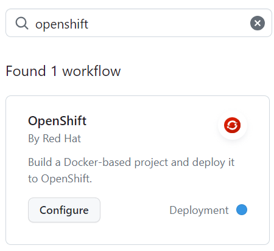

# Nodeapp

## Build and Deploy a containerized Node app to NERC's OpenShift cluster.

This demo Node.js application shows a simple container based app can easily be
bootstrapped onto NERC's OpenShift (OCP) cluster using CI/CD Pipeline by GitHub
Actions.

You can try it out by forking this sample app or use your own container based application.
 
| Step        |             |
| ----------- | ----------- |
| 1. Get an access to the NERC's OpenShift Container Platform at https://console.apps.shift.nerc.mghpcc.org. To get access NERC's OCP web console you need to be part of ColdFront's active allocation as described [here](https://nerc-project.github.io/nerc-docs/get-started/get-an-allocation/#request-a-new-openshift-resource-allocation-for-openshift-project). |        |
| 2. Setup the OpenShift CLI Tools locally and Configuring the OpenShift CLI to enable `oc` commands. Refer to [this user guide]( https://nerc-project.github.io/nerc-docs/openshift/logging-in/setup-the-openshift-cli/). |        |
| 3. Setup Github CLI on your local machine: https://docs.github.com/en/github-cli/github-cli/quickstart and verify you are able to run `gh` commands. |        |
| 4. Run either `setsecret.cmd` file if you are using Windows or `setsecret.sh` file if you are using Linux based machine. Once executed, verify Github Secrets are set Properly under your github repo's settings >> secrets and variables >> Actions as shown here. |        |
| 5. Add the OpenShift Workflow in the Actions tab of in your GitHub repository.   |          |
| 6. Fill in the details for each of the necessary components. Each edit location is marked with  a 🖊️ so you can easily find and configure the workflow.       |     | 
| 7. Push your changes and watch it build and deploy to your cluster.     |            |
